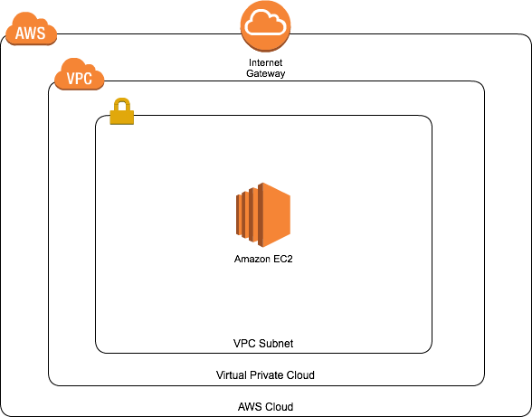
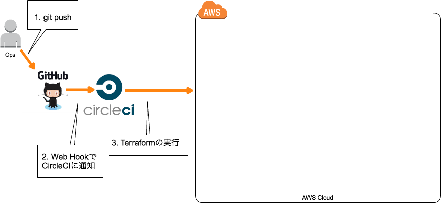

layout: true
class: center, middle

---
background-image: url(images/terraform.png)
# Terraform実践入門
### AWS Premier Night #2<br/>in Osaka<br/>2016/09/16 中山 幸治

---
# 自己紹介

---
# 中山 幸治(knakayama)&nbsp;
### [https://knakayama.github.io](https://knakayama.github.io)
### 

---
# クラスメソッド<br/>AWSコンサルティング部<br/>所属

---
# 今日の資料↓に置いときました
### [https://github.com/knakayama/slide-2016-09-16](https://github.com/knakayama/slide-2016-09-16)
### 「knakayama」とかでググれば出てくると思います

---
layout: true
class: center, middle

---
# アジェンダ

---
layout: true
class: middle

---
### 1. Terraformについて
### 2. ベストプラクティス
### 3. Pull Requestベースのインフラ開発
### 4. 既存AWSリソースをコード化する
### 5. もっと深く知りたい方へ

---
layout: true
class: center, middle

---
# 今回の発表内容の目標

---
layout: true
class: middle

---
## 目標
### - Terraformの使い方を知る
### - コードでAWSを管理する方法を知る
### - マネジメントコンソールで作った環境をコード化する方法を知る
### - 初級 〜 中級なので肩の力を抜いて聞いていただければ

---
layout: true
class: center, middle

---
# ちなみにCloudFormationの話はしません

---
layout: true
class: middle

---
## 理由
### - 宗教戦争っぽくなるから
### - できることだいたい同じだから
### - 「どちらがよいのか」判断しようとすると機能より人の思想に影響されるから
### - 普段CloudFormationあまり使ってないので機能の比較ができないから

---
layout: true
class: center, middle

---
# 好きな方使えばいい<br/>と思います

---
# 1. Terraformについて

---
layout: true
class: middle

---
## 概要
### - HashiCorp社を中心として開発されているOSSのインフラ構成ツール
### - AWS/GCP/Azureなど主要なクラウドサービスに対応
### - 「リソース」または「データソース」という概念で利用サービス(EC2/RDSなど)を定義
### - HCLという独自言語でリソースをコードとして管理できる

---
layout: true
class: middle

---
### &nbsp;&nbsp;&nbsp;&nbsp;&nbsp;&nbsp;&nbsp;&nbsp;&nbsp;&nbsp;&nbsp;&nbsp;&nbsp;&nbsp;&nbsp; 変数には文字列/リスト/マップが利用可能
```bash
# 文字列
variable "vpc_cidr" {
  default = "172.16.0.0/16"
}
# "${var.vpc_cidr}" => "172.16.0.0/16"

# リスト
variable "zones" {
  default = [
    "us-east-1a",
    "us-east-1b"
  ]
}
# "${var.vpc_cidr[0]}" => "us-east-1a"

# マップ
variable "spot_config" {
  default = {
    instance_type        = "c3.large"
    price                = "0.1"
    wait_for_fulfillment = true
    type                 = "one-time"
  }
}
# "${var.spot_config["price"]}" => "0.1"
```

---
### &nbsp;&nbsp;&nbsp;&nbsp;&nbsp;&nbsp;&nbsp;&nbsp;&nbsp;&nbsp;&nbsp;&nbsp;&nbsp;&nbsp;&nbsp;&nbsp;&nbsp;&nbsp;&nbsp;&nbsp;&nbsp;&nbsp;&nbsp; さまざまな関数が用意されている
```bash
# cidrsubnet関数: CIDRをうまいこと計算
cidr_block = "${cidrsubnet(var.vpc_cidr, 8, 1)}"

# file関数: ファイルの中身を参照
user_data = "${file("${path.module}/user_data/cloud_config.yml")}"
```

### &nbsp;&nbsp;&nbsp;&nbsp;&nbsp;&nbsp;&nbsp;&nbsp;&nbsp;&nbsp;&nbsp;&nbsp;&nbsp;&nbsp;&nbsp;&nbsp;&nbsp;&nbsp;&nbsp;&nbsp;&nbsp;&nbsp;&nbsp;&nbsp;&nbsp;&nbsp;&nbsp;&nbsp;&nbsp;&nbsp;&nbsp;&nbsp;&nbsp;&nbsp;&nbsp; ループも可能
```bash
# count: 2回ループさせている
# element関数: リストの要素を参照
resource "aws_route_table_association" "public" {
  count          = 2
  subnet_id      = "${element(aws_subnet.public.*.id, count.index)}"
  route_table_id = "${aws_route_table.public.id}"
}
```

---
## Terraformのファイル
### - インフラの「あるべき状態」をtfファイルに記述
### - インフラの「実際の状態」がtfstateファイルに書き込まれる

---
### &nbsp;&nbsp;&nbsp;&nbsp;&nbsp;&nbsp;&nbsp;&nbsp;&nbsp;&nbsp;&nbsp;&nbsp;&nbsp;&nbsp;&nbsp;&nbsp;&nbsp;&nbsp;&nbsp;&nbsp;&nbsp;&nbsp;&nbsp;&nbsp;&nbsp;&nbsp;&nbsp;&nbsp;例: リソースの定義の方法
```bash
resource "<リソースタイプ>" "<リソースネーム>" {
  # ここに具体的なリソースの定義を記述
}

# 例: EC2インスタンスの作成
resource "aws_instance" "web" {
  ...
}
```

### &nbsp;&nbsp;&nbsp;&nbsp;&nbsp;&nbsp;&nbsp;&nbsp;&nbsp;&nbsp;&nbsp;&nbsp;&nbsp;&nbsp;&nbsp;&nbsp;&nbsp;&nbsp;&nbsp;&nbsp;&nbsp;&nbsp;&nbsp;&nbsp;&nbsp;&nbsp;例: データソースの定義の方法
```bash
data "<データソースタイプ>" "<データソースネーム>" {
  # ここに具体的なデータソースの定義を記述
}

# 例: AMIの検索
data "aws_ami" "amazon_linux" {
  ...
}
```

---
### &nbsp;&nbsp;&nbsp;&nbsp;&nbsp;&nbsp;&nbsp;&nbsp;&nbsp;&nbsp;&nbsp;&nbsp;&nbsp;tfファイルの例: スポットインスタンスの作成
```bash
resource "aws_spot_instance_request" "web" {
  spot_price                  = "${var.spot_config["price"]}"
  spot_type                   = "${var.spot_config["type"]}"
  wait_for_fulfillment        = "${var.spot_config["wait_for_fulfillment"]}"
  ami                         = "${data.aws_ami.amazon_linux.id}"
  instance_type               = "${var.spot_config["instance_type"]}"
  key_name                    = "${aws_key_pair.key_pair.key_name}"
  vpc_security_group_ids      = ["${aws_security_group.web.id}"]
  subnet_id                   = "${aws_subnet.public.id}"
  user_data                   = "${file("${path.module}/user_data/cloud_config.yml")}"
  iam_instance_profile        = "${aws_iam_instance_profile.instance_profile.id}"
  associate_public_ip_address = true
  block_duration_minutes      = 60

  tags {
    Name = "${var.name}"
  }
}
```

---
### &nbsp;&nbsp;&nbsp;&nbsp;&nbsp;&nbsp;&nbsp;&nbsp;&nbsp;&nbsp;tfstateファイルの例: EC2インスタンスの情報
```json
"resources": {
    "aws_instance.web": {
        "type": "aws_instance",
        "depends_on": [
            "aws_key_pair.site_key",
            "aws_security_group.web",
            "aws_subnet.public"
        ],
        "primary": {
            "id": "i-75a9dbea",
            "attributes": {
                "ami": "ami-383c1956",
                "associate_public_ip_address": "true",
                "availability_zone": "ap-northeast-1a",
                "disable_api_termination": "false",
                "ebs_block_device.#": "0",
                "ebs_optimized": "false",
                "ephemeral_block_device.#": "0",
                "iam_instance_profile": "",
                "id": "i-75a9dbea",
                "instance_state": "running",
                "instance_type": "t2.micro",
                "key_name": "test",
                "monitoring": "false",
                "private_dns": "ip-172-16-0-192.ap-northeast-1.compute.internal",
<snip>
```

---
## Terraformの実行方法
### - Terraformはコマンドラインから実行する
### - 基本的にはPlanで実行内容を確認してApplyで実行
### - この2つのファイルを比較して実行前に差分を確認可能

---
### &nbsp;&nbsp;&nbsp;&nbsp;&nbsp;&nbsp;&nbsp;&nbsp;&nbsp;&nbsp;&nbsp;&nbsp;&nbsp;&nbsp;&nbsp;&nbsp;&nbsp;&nbsp;&nbsp;&nbsp;&nbsp;&nbsp;&nbsp;&nbsp;&nbsp;&nbsp;&nbsp;&nbsp;&nbsp;&nbsp;&nbsp;&nbsp;変更内容の確認(Plan)
```bash
$ terraform plan
<snip>
+ aws_instance.web
    ami:                                       "" => "ami-383c1956"
    associate_public_ip_address:               "" => "true"
    availability_zone:                         "" => "<computed>"
    ebs_block_device.#:                        "" => "<computed>"
<snip>
Plan: 9 to add, 0 to change, 0 to destroy.
```

### &nbsp;&nbsp;&nbsp;&nbsp;&nbsp;&nbsp;&nbsp;&nbsp;&nbsp;&nbsp;&nbsp;&nbsp;&nbsp;&nbsp;&nbsp;&nbsp;&nbsp;&nbsp;&nbsp;&nbsp;&nbsp;&nbsp;&nbsp;&nbsp;&nbsp;&nbsp;&nbsp;&nbsp;&nbsp;&nbsp;&nbsp;&nbsp;&nbsp;&nbsp;&nbsp;&nbsp;&nbsp;&nbsp;実行(Apply)
```bash
$ terraform apply
<snip>
aws_instance.web: Creating...
  ami:                                       "" => "ami-383c1956"
  associate_public_ip_address:               "" => "true"
  availability_zone:                         "" => "<computed>"
  ebs_block_device.#:                        "" => "<computed>"
<snip>
Outputs:

  web_public_ip = 54.238.149.223
```

---
layout: true
class: center, middle

---
# Demo
### TerraformでEC2インスタンス作ってみる

---
### 構成図


---
# 2. ベストプラクティス

---
layout: true
class: middle

---
### - 1. リソース毎にtfファイルを分離してトップディレクトリに置く
### - 2. 環境(本番/開発/ステージング)毎にコードを使いまわせるように、一番大本となるtfファイルをモジュールを利用して分離させる
### - 3. 特定の環境のみ利用したいリソースがある場合は、モジュールを利用して分離させる
### - 4. トップディレクトリにMake系ファイルを置いてTerraformの実行をタスク化する

---
layout: true
class: center, middle

---
# なるほど、<br/>まったくわからん。

---
# 実際にベストプラクティスに沿ったディレクトリ構造を見ながら解説します

---
layout: true
class: middle

---
## リソース毎にtfファイルを分離する
### - Terraformはカレントディレクトリのtfファイルを全て実行する
### - 1つのファイルに記述しても、他のファイルに分離しても動作は全く同じ
### - リソースの依存関係は基本的にTerraform側で自動的に解決してくれる
### - 基本的にtfファイルはトップディレクトリにずらずらと設置する

---
## モジュールを利用して環境毎にコードを使いまわせるようにする
### - モジュールとは簡単に説明すると関数
### - ローカル/リモート上のTerraformのコードを呼び出せる機能
### - `variables.tf` で各環毎の差分を吸収する(開発環境ではインスタンスタイプを低くするなど)
### - こうすることで環境毎の差異を吸収しつつ冗長性を排除可能

---
## モジュールを利用して環境毎の差異を吸収する
### - IAMやRoute53など特定の環境のみで管理したい場合に利用
### - `modules/iam` などのディレクトリを掘ってそこにtfファイルを設置する
### - コードを共有しつつ環境毎の違いに対応可能

---
## Make系ファイルを置いてTerraformの実行をタスク化する
### - Terraformはカレントディレクトリのtfファイルを実行するためディレクトリを移動する必要がある
### - ディレクトリは各環境毎( `env/<環境>` )に異なる
### - いちいちcdで移動するの面倒なのでタスク化させる
### - トップディレクトリに設置する

---
layout: true
class: center, middle

---
# 3. Pull Requestベースの<br/>インフラ開発

---
layout: true
class: middle

---
## PRベースのインフラ開発を導入する利点
### - 複数人でインフラを管理する場合に必要な仕組み
### - ローカルでTerraformを実行しているとtfstateの共有/同時実行/バージョンの違いなどでオペミスが発生しがち
### - Terraformの実行箇所を1つに絞ることで上記問題を解決

---
## PRベースのインフラ開発を実装する方法
### - TerraformのコードをGitHubで管理
### - GitHubへのpushを契機としてCircleCIにWebHookで通知
### - tfstateファイルはリモートステートでS3などに保存
### - テスト用ブランチ/リリース用ブランチを作成
### - `circle.yml` にTerraformの実行方法を記述する

---
### CircleCIを利用したTerraformのデプロイ


---
### &nbsp;&nbsp;&nbsp;&nbsp;&nbsp;&nbsp;&nbsp;&nbsp;&nbsp;CircleCIのコンテナ上でTerraformの環境を整える
```yaml
# 環境変数の定義
machine:
  environment:
    S3_BUCKET: _YOUR_BUCKET_NAME_
    AWS_DEFAULT_REGION: ap-northeast-1
    TERRAFORM_VER: 0.7.3

# Terraformのインストール
dependencies:
  override:
    - |
      if [[ ! -f ~/.local/bin/terraform ]]; then
        mkdir -p ~/.local/bin
        cd ~/.local/bin
        wget "https://releases.hashicorp.com/terraform/${TERRAFORM_VER}/terraform_${TERRAFORM_VER}_linux_amd64.zip"
        unzip *.zip
        rm *.zip
      fi
  cache_directories:
    - ~/.local/bin
```

---
### &nbsp;&nbsp;&nbsp;&nbsp;&nbsp;&nbsp;&nbsp;&nbsp;&nbsp;&nbsp;&nbsp;&nbsp;&nbsp;&nbsp;&nbsp;&nbsp;&nbsp;&nbsp;&nbsp;&nbsp;&nbsp;&nbsp;&nbsp;&nbsp;&nbsp;&nbsp;&nbsp;&nbsp;&nbsp;&nbsp;&nbsp;&nbsp;&nbsp;&nbsp;&nbsp;&nbsp;テストの定義
```yaml
# planを正常に実行できるかでテストを定義
# CIRCLE_BRANCHにブランチ名が含まれるので正規表現を利用
# 特定のブランチ名にマッチする場合はplanを実行
test:
  override:
    - |
      if [[ "${CIRCLE_BRANCH}" =~ (release/)?dev/? ]]; then
        make remote-enable ENV=dev
        make terraform ENV=dev ARGS="get -update"
        make terraform ENV=dev ARGS=plan
      elif [[ "${CIRCLE_BRANCH}" =~ (release/)?stg/? ]]; then
        make remote-enable ENV=stg
        make terraform ENV=stg ARGS="get -update"
        make terraform ENV=stg ARGS=plan
      elif [[ "${CIRCLE_BRANCH}" =~ (release/)?prd/?|master ]]; then
        make remote-enable ENV=prd
        make terraform ENV=prd ARGS="get -update"
        make terraform ENV=prd ARGS=plan
      fi
```

---
### &nbsp;&nbsp;&nbsp;&nbsp;&nbsp;&nbsp;&nbsp;&nbsp;&nbsp;&nbsp;&nbsp;&nbsp;&nbsp;&nbsp;&nbsp;&nbsp;&nbsp;&nbsp;&nbsp;&nbsp;&nbsp;&nbsp;&nbsp;&nbsp;&nbsp;&nbsp;&nbsp;&nbsp;&nbsp;リリースブランチの設定
```yaml
# リリースブランチの定義
# pushしたブランチ名がrelease/(dev|stg|prd)であればapplyを実行
deployment:
  development:
    branch: release/dev
    commands:
      - make terraform ENV=dev ARGS="get -update"
      - make terraform ENV=dev ARGS=apply
      - make terraform ENV=dev ARGS="remote push"
  staging:
    branch: release/stg
    commands:
      - make terraform ENV=stg ARGS="get -update"
      - make terraform ENV=stg ARGS=apply
      - make terraform ENV=stg ARGS="remote push"
  production:
    branch: release/prd
    commands:
      - make terraform ENV=prd ARGS="get -update"
      - make terraform ENV=prd ARGS=apply
      - make terraform ENV=prd ARGS="remote push"
```

---
layout: true
class: center, middle

---
# 4. 既存AWSリソースを<br/>コード化する

---
layout: true
class: middle

---
## 既存リソースのコード化
### - マネジメントコンソールで作ったAWSリソースをコード化したい要望はある、似た構成を別途作りたい場合など
### - Terraformでは既存AWSリソースからtfとtfstateファイルを生成する必要がある
### - 現在主に2つの方法がある
### - 1. Terraformのimport機能
### - 2. terraforming

---
layout: true
class: center, middle

---
# 1. Terraformのimport機能

---
layout: true
class: middle

---
## Terraformのimport機能
### - 既存リソースをTerraformに取り込む(import)機能
### - まだtfstateファイルのimportしか対応してない
### - 特定リソース(vpc-xxxのVPC)単位でimport可能
### - merge/overwriteのような操作は現時点では未対応
### - 細かい操作は `state` コマンドでtfstateファイルを修正する
### - まだまだ発展途上だが今後機能が拡充されていく予定

---
### &nbsp;&nbsp;&nbsp;&nbsp;&nbsp;&nbsp;&nbsp;&nbsp;&nbsp;&nbsp;&nbsp;&nbsp;&nbsp;&nbsp;&nbsp;&nbsp;&nbsp;&nbsp;&nbsp;&nbsp;&nbsp;&nbsp;&nbsp;&nbsp;&nbsp;&nbsp;&nbsp;&nbsp;&nbsp;&nbsp;&nbsp;&nbsp;&nbsp;&nbsp;&nbsp;主要なコマンド
```bash
# 書式: import <リソースタイプ>.<リソースネーム> <ID>
$ terraform import aws_instance.web i-75a9dbea
# Terraformの管理下にあるリソース/データソース一覧を表示
$ terraform state show
# 特定のリソース/データソースを詳細表示
$ terraform state list aws_instance.web
# リソース/データソース名を変更
$ terraform state mv aws_instance.web aws_instance.db
# リソース/データソースを削除
$ terraform state rm aws_instance.db
```

---
layout: true
class: center, middle

---
# 2. terraforming

---
layout: true
class: middle

---
## terraforming
### - https://github.com/dtan4/terraforming
### - 既存リソースからtf/tfstateファイルを作成可能
### - AWSサービス単位(VPCなど)で作成
### - 特定リソース(vpc-xxxのVPC)のみ作成することは不可
### - tfstateファイルの操作が細かく制御可能(merge/overwrite)

---
### &nbsp;&nbsp;&nbsp;&nbsp;&nbsp;&nbsp;&nbsp;&nbsp;&nbsp;&nbsp;&nbsp;&nbsp;&nbsp;&nbsp;&nbsp;&nbsp;&nbsp;&nbsp;&nbsp;&nbsp;&nbsp;&nbsp;&nbsp;&nbsp;&nbsp;&nbsp;&nbsp;&nbsp;&nbsp;&nbsp;&nbsp;&nbsp;&nbsp;&nbsp;&nbsp;主要なコマンド
```bash
# tfファイルのimport
$ terraforming ec2
# tfstateファイルのimport
$ terraforming ec2 --tfstate
# tfstateファイルへの追記(標準出力に表示するのみ)
$ terraforming vpc --tfstate --merge=terraform.tfstate
# tfstateファイルの上書き(ファイルを実際に上書きする)
$ terraforming vpc --tfstate --merge=terraform.tfstate --overwrite
```

---
## 既存AWSリソースをimportする場合
### - terraformingとTerraformのimport機能を使って「泥臭く」実施する必要がある
### - 戦略としてはterraformingで一括importしてtf/tfstateファイルを生成
### - 手動で適宜修正し対応してないAWSリソースはTerraformのimportを利用
### - Terraformのimportにも対応してない場合はtfstateを手動で生成させる

---
### &nbsp;&nbsp;&nbsp;&nbsp;&nbsp;&nbsp;&nbsp;&nbsp;&nbsp;&nbsp;&nbsp;&nbsp;&nbsp;&nbsp;&nbsp;&nbsp;&nbsp;&nbsp;&nbsp;&nbsp;&nbsp;既存AWSリソースをimportする例
```bash
# terraformingが対応している全てのAWSリソースをとりあえずimport
$ terraforming help | grep terraforming | grep -v help \
  | awk '{print "terraforming", $2, "--profile", "default", ">", $2".tf";}' | bash
# 空のファイルを削除
$ find . -type f | xargs wc -l | grep '1 .' | awk '{print $2;}' | xargs rm
# 不要なtfファイルを削除
$ rm hoge.tf
# リソースを修正/削除/追記
$ $EDITOR hoge.tf
# 雛形となるtfstateファイルを作成
$ echo '{"version": 1,"serial": 37,"modules": [{"path": ["root"],"outputs": {},"resources":{}}]}' > terraform.tfstate
# tfstateファイルの生成
$ ls -1 *.tf | sed 's/\.tf//' \
  | awk '{print "terraforming", $1, "--profile", "default", "--tfstate --merge=terraform.tfstate --overwrite";}' | bash
# 不要なstateを削除
$ terraform state rm hoge.fuga
# terraformingで対応してないstateをimport
$ terraform import hoge.fuga
# stateを適宜リネーム
$ terraform state mv hoge.fuga foo.bar
# 差分がないかチェック
$ terraform plan
```

---
layout: true
class: center, middle

---
# 5. もっと深く知りたい方へ

---
layout: true
class: middle

---
## 公式ドキュメントとCHANGELOG見ておけばOK
### - https://www.terraform.io/docs/
### - https://github.com/hashicorp/terraform/blob/master/CHANGELOG.md

---
## サーバレスに興味あったらApexも触っておくと吉
### - http://apex.run/

---
layout: true
class: center, middle

---
# おわり
